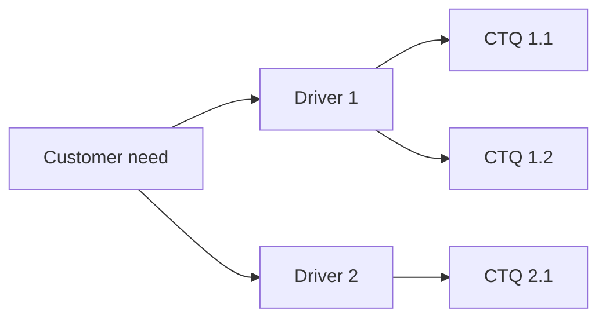

# CTQ tree

```mermaid
flowchart LR
    N[Customer need] --> D1[Driver 1]
    N --> D2[Driver 2]
    D1 --> C1[CTQ 1.1]
    D1 --> C2[CTQ 1.2]
    D2 --> C3[CTQ 2.1]
```

| Need | Driver | CTQ | Measure | Target / spec limit | Current value |
|---|---|---|---|---|---|
| | | | | | |
| | | | | | |
| | | | | | |
